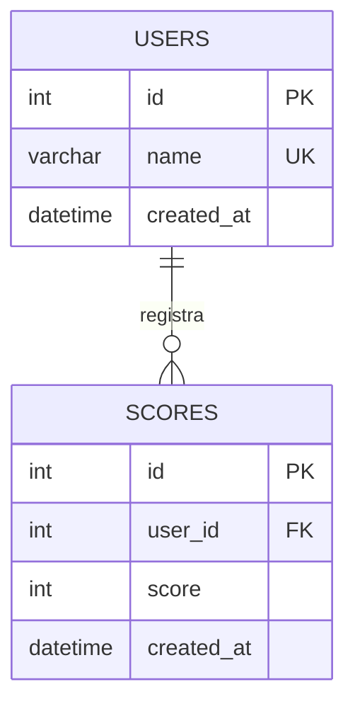

# Pokemon API con puntajes y base de datos

Aplicacion web dinamica que consume PokeAPI, permite jugar un quiz de Pokemon y guarda los puntajes por usuario en MySQL usando PHP.

## Donde se prueba cada parte

- GitHub Pages: solo prueba `index.html`, `detail.html`, `quiz.html`, estilos y consumo de PokeAPI. No ejecuta PHP ni MySQL.
- XAMPP: prueba completa de la aplicacion con PHP, MySQL, logs y reportes.
- MySQL Workbench: administracion visual de la base de datos `pokemon_api`.

## Navegacion

- `index.html`: muestra Pokemon aleatorios desde PokeAPI.
- `detail.html`: muestra detalle y evoluciones de un Pokemon.
- `quiz.html`: juego interactivo, registro de puntajes, historial por usuario y reportes agrupados.

## Tecnologia

- HTML, CSS y JavaScript para la interfaz.
- PHP para endpoints de base de datos y reportes.
- MySQL/MariaDB desde XAMPP como base de datos.
- MySQL Workbench para consultar tablas y ejecutar scripts SQL.
- Logs en `logs/app.log`.

## Configuracion de base de datos

El backend usa la configuracion tipica de XAMPP:

```text
Host: 127.0.0.1
Base de datos: pokemon_api
Usuario: root
Contrasena: vacia
```

La configuracion esta en `api/db.php`.

## Opcion A: crear la BD desde la app

1. Abre XAMPP.
2. Inicia Apache y MySQL.
3. Copia este proyecto en `C:\xampp\htdocs\pokemonAPI`.
4. Abre `http://localhost/pokemonAPI/quiz.html`.

La app intentara crear la base `pokemon_api`, las tablas y los usuarios iniciales automaticamente.

## Opcion B: crear la BD desde Workbench

1. Abre MySQL Workbench.
2. Crea una conexion a `127.0.0.1`, usuario `root`, sin contrasena.
3. Abre el archivo `database.sql`.
4. Ejecuta el script completo.
5. Abre `http://localhost/pokemonAPI/quiz.html`.

## GitHub Pages

GitHub Pages no puede usar `api/*.php`, `logs/app.log` ni MySQL. Si publicas este repo en Pages, la lista de Pokemon y la navegacion estatica funcionan, pero el guardado de puntajes mostrara un error porque no existe servidor PHP.

Para entregar el requisito de base de datos, usa capturas o demostracion local con XAMPP + Workbench.

## Modelo entidad-relacion



## Endpoints

- `GET api/users.php`: lista usuarios registrados.
- `POST api/scores.php`: inserta un puntaje con `user_id` y `score`.
- `GET api/scores.php?user_id=1`: consulta registros de una persona.
- `GET api/reports.php?period=week`: reporte por semana.
- `GET api/reports.php?period=month`: reporte por mes.
- `GET api/reports.php?period=all`: reporte historico.
